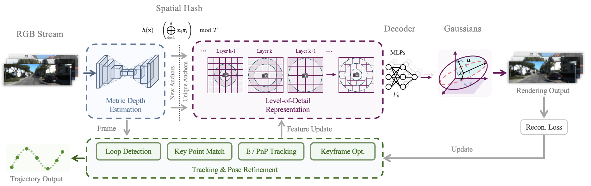
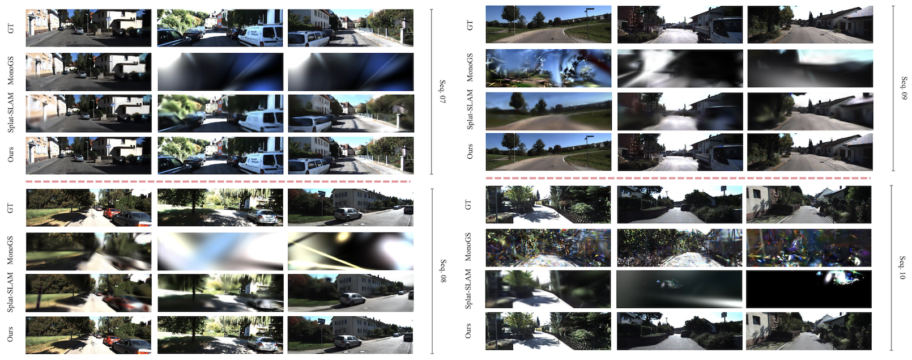
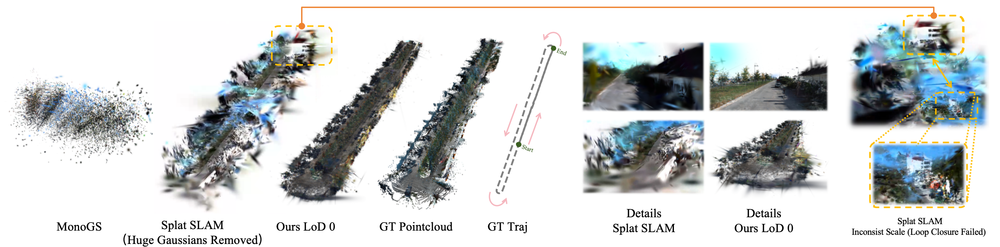
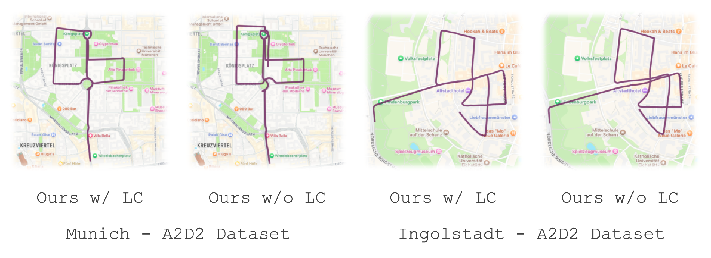
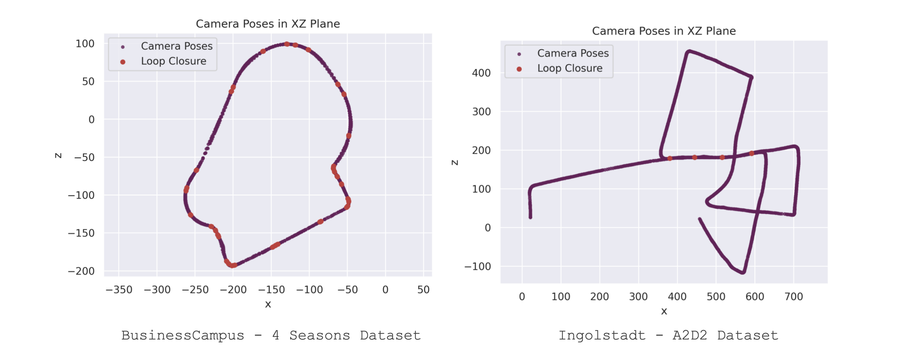

<p align="center">
<p align="center">
<h1 align="center">GigaSLAM: Large-Scale Monocular SLAM with Hierarchical Gaussian Splats</h1>
</p>

This repository contains the source code for our papers:

[GigaSLAM: Large-Scale Monocular SLAM with Hierarchical Gaussian Splats](https://arxiv.org/abs/2503.08071)

**Abstrat:** Tracking and mapping in large-scale, unbounded outdoor environments using ***only monocular RGB input*** presents substantial challenges for existing SLAM systems. Traditional Neural Radiance Fields (NeRF) and 3D Gaussian Splatting (3DGS) SLAM methods are typically limited to small, bounded indoor settings. To overcome these challenges, we introduce ***GigaSLAM***, the ***first RGB*** NeRF / 3DGS-based SLAM framework for ***kilometer-scale outdoor environments***, as demonstrated on the KITTI, KITTI 360, 4 Seasons and A2D2 datasets. Our approach employs a hierarchical sparse voxel map representation, where Gaussians are decoded by neural networks at multiple levels of detail. This design enables efficient, scalable mapping and high-fidelity viewpoint rendering across expansive, unbounded scenes. For front-end tracking, GigaSLAM utilizes a metric depth model combined with epipolar geometry and PnP algorithms to accurately estimate poses, while incorporating a Bag-of-Words-based loop closure mechanism to maintain robust alignment over long trajectories. Consequently, GigaSLAM delivers high-precision tracking and visually faithful rendering on urban outdoor benchmarks, establishing a robust SLAM solution for large-scale, long-term scenarios, and significantly extending the applicability of Gaussian Splatting SLAM systems to unbounded outdoor environments.









We would like to thank [Devin.ai](https://devin.ai/) for providing large language model tools to assist in analyzing the repository code and help everyone better understand `GigaSLAM`. Below is the link to our repository - we welcome all visitors:

https://deepwiki.com/DengKaiCQ/GigaSLAM

### **Change Log**

`[26 May 2025]` 1. Fixed several issues including config files and submodule problems; 2. Refactored the code to reduce unnecessary memory allocations and improve thread-level parallelism; 3. Restructured parts of the underlying logic of the code; 4. Updated the paper, added some experiments and visualizations, and improved the writing of the article.

`[11 Mar 2025]` Arxiv paper submitted.

##  Setup, Installation & Running

### 🖥️ 1 - Hardware and System Environment 

This project was developed, tested, and run in the following hardware/system environment

```
Hardware Environment：
    CPU(s): Intel Xeon(R) Gold 6128 CPU @ 3.40GHz × 12 / Intel Xeon(R) Platinum 8467C CPU @ 2.60GHz x 20
    GPU(s): NVIDIA RTX 4090 (24 GiB VRAM) / NVIDIA L20 (48 GiB GDDR6)
    RAM: 67.0 GiB (DDR4, 2666 MT/s) / 128.0 GiB (DDR4, 3200 MT/s)
    Disk: Dell 8TB 7200RPM HDD (SATA, Seq. Read 220 MiB/s)

System Environment：
    Linux System: Ubuntu 22.04.3 LTS
    CUDA Version: 11.8
    cuDNN Version: 9.1.0
    NVIDIA Drivers: 555.42.06
    Conda version: 23.9.0 (Miniconda)

Compilers & Build Tools:
    NVIDIA CUDA Compiler (nvcc): V11.8.89
    C++ Compiler: GCC/G++ 11.4.0
    GNU Make Version: 4.3
    Cmake Version: 3.22.1
```

As part of the project code relies on `CUDA/C++`, please ensure your compilation environment is properly workable.

### 📦 2 - Environment Setup 

#### Step 1: Dependency Installation

Creating a virtual environment using conda (or miniconda)

```bash
conda create -n gigaslam python=3.10
conda activate gigaslam
# pip version created by conda: 25.1
```

Next, install `PyTorch`

```bash
pip install torch==2.2.0 torchvision==0.17.0 torchaudio==2.2.0 --index-url https://download.pytorch.org/whl/cu118
# Verified to work with CUDA 11.8 and torch 2.2.0
```

Then install other dependencies

```bash
pip install -r requirements.txt
```

**Note:** If you encounter installation issues with `torch_scatter` (which may happen in certain network environments), comment out the corresponding line in `requirements.txt` and manually download & install the wheel from link: https://pytorch-geometric.com/whl/

```bash
# Download the torch_scatter wheel package for torch-2.2.0 + CUDA 11.8
wget https://data.pyg.org/whl/torch-2.2.0%2Bcu118/torch_scatter-2.1.2%2Bpt22cu118-cp310-cp310-linux_x86_64.whl  
# Alternative: Manually download via browser from the same URL

# Install the torch_scatter from the local wheel file
pip install ./torch_scatter-2.1.2+pt22cu118-cp310-cp310-linux_x86_64.whl
```


> **Special Note Regarding Version Compatibility:**
> Particular attention must be paid to the `xformers-0.0.24` dependency specified in `requirements.txt`. If you attempt to install alternative versions of `torch` (other than the explicitly recommended `2.2.0`), subsequent installations of `xformers` via `pip` will **force-uninstall** your current `PyTorch` version and replace it with the specific version deemed compatible by `xformers`. This forced version downgrade/upgrade poses critical risks to `CUDA/C++` compilation workflows, as PyPI-distributed `xformers` packages are **pre-compiled binaries** tightly coupled to specific CUDA toolkit and `PyTorch` versions.
>
> **Extended Compatibility Guidance:**
> For developers requiring alternative `xformers` or `PyTorch` versions, consult the [xFormers GitHub Repository](https://github.com/facebookresearch/xformers) for version relationships. While the repository lacks an official compatibility reference, we have curated version compatibility references by cross-referencing release notes. The following table may assist both GigaSLAM users and general developers who are encountering similar dependency conflicts:
>
> | `xFormers` | `PyTorch` | `xFormers` | `PyTorch` |
> | :-------: | :-------: | :-------: | :-------: |
> |  0.0.21   |   2.0.1   |  0.0.26   |   2.2.0   |
> |  0.0.22   |   2.0.1   |  0.0.27   |   2.3.0   |
> |  0.0.23   |   2.1.1   |  0.0.28   |   2.4.1   |
> |  0.0.24   |   2.2.0   |  0.0.29   |   2.5.1   |
> |  0.0.25   |   2.2.0   |  0.0.30   |   2.7.0   |

#### Step 2: Compiling the `CUDA/C++` Modules

Proceed to install the required `CUDA/C++` components. **Thoroughly verify your build environment** – incompatible compiler versions, conflicting dependencies, or mismatched CUDA toolkits may cause compilation failures or unexpected binary behavior. 

##### Step 2.1: Compile 3D GS Rendering Module

```
pip install submodules/simple-knn
pip install submodules/diff-gaussian-rasterization
```

##### Step 2.2: Compile Loop-Closure Detection Module

Install the `OpenCV C++ API`.

```
sudo apt-get install -y libopencv-dev
```

Install `DBoW2`

```
cd DBoW2
mkdir -p build && cd build
cmake ..
make
sudo make install
cd ../..
```

Install the image retrieval

```
pip install ./DPRetrieval
```

##### Step 2.3: Compile Loop-Closure Correction Module

```bash
python setup.py install
```

#### Step 3: Bag of Words Model Setup

Download the pre-trained Bag of Words vocabulary for `DBoW2`:

```bash
# Download the vocabulary file (about 150 MiB)
wget https://github.com/UZ-SLAMLab/ORB_SLAM3/raw/master/Vocabulary/ORBvoc.txt.tar.gz
# Or, you could download manually from the link via your browser

# Extract the vocabulary file
tar -xzvf ORBvoc.txt.tar.gz

# Verify extraction
ls -l ORBvoc.txt
```

### 🚀 3 - Running the code 

Before running the project, you need to modify the `.yaml` files under the `./config` directory.  Specifically, replace the dataset path with the path to your downloaded dataset in `PNG` or `JPG` format and the camera intrinsics `fx` `fy` `cx` `cy`. For example,

```yaml
...
Dataset:
  color_path: "/media/deng/Data/4SeasonsDataset/BusinessCampus_recording_2020-10-08_09-30-57/undistorted_images/cam0" 
  # replace it to your local path
  Calibration:
    fx: 501.4757919305817
...
```

Then, run the following command to start the SLAM process. **Pretrained weights** for `DISK`, `LightGlue`, and `UniDepth` will be automatically downloaded on the first execution:

```bash
python slam.py --config ./path_to_your_config.yaml
```

for example,

```bash
python slam.py --config ./kitti_06.yaml
```

**Note on loading `UniDepth` from HuggingFace:** `UniDepth` models are loaded from **HuggingFaceHub** by default.  However, due to network restrictions **in certain countries/regions**, even with a VPN, the model may fail to load properly. If this happens, set the `['DepthModel']['from_huggingface']` to `False`.  Then manually download the `UniDepth` model weights (e.g., via a web browser),  and set the local path to the downloaded weights in the `['DepthModel']['local_snapshot_path']` field. You can find download links for various `UniDepth` model weights in the [UniDepth repository](https://github.com/lpiccinelli-eth/UniDepth).

The snapshot directory may contain the files as follows:

```yaml
snapshot_dir
    ├── config.json
    ├── model.safetensors
    └── pytorch_model.bin
```

If you set `['SLAM']['viz']` to `True` in the `.yaml` file, you will be able to see output like the following in the `result/your_exp/` directory during execution:



> **Important Notes:** This project is implemented based on the MonoGS framework, whose native architecture primarily targets small-scale scenes. In terms of hardware requirements, processing ultra-long sequence data significantly increases CPU RAM load - through targeted optimizations, we have stabilized the CPU memory consumption of 4000-frame KITTI datasets at approximately 10 GiB. However, longer sequences may still require additional memory resources. We strongly recommend running this system on server environments equipped with 32+ GiB CPU RAM. For **personal computers**  (particularly common 16 GiB CPU RAM setups), please continuously monitor memory usage via System Monitor (or similar) to prevent sudden memory spikes from affecting other system processes.
>
> We are currently exploring methods to further optimize memory consumption to achieve better operational efficiency.

## Acknowledgements

Our project is based on [Scaffold-GS](https://github.com/city-super/Scaffold-GS), [UniDepth](https://github.com/lpiccinelli-eth/UniDepth), [MonoGS](https://github.com/muskie82/MonoGS), [DF-VO](https://github.com/Huangying-Zhan/DF-VO), [DPVO (DPV-SLAM)](https://github.com/princeton-vl/DPVO). Our work would not have been possible without these excellent repositories.

## Citation

If you find our work helpful, please consider citing:

```bibtex
@article{deng2025gigaslam,
  title={GigaSLAM: Large-Scale Monocular SLAM with Hierarchical Gaussian Splats},
  author={Deng, Kai and Yang, Jian and Wang, Shenlong and Xie, Jin},
  journal={arXiv preprint arXiv:2503.08071},
  year={2025}
}
```
